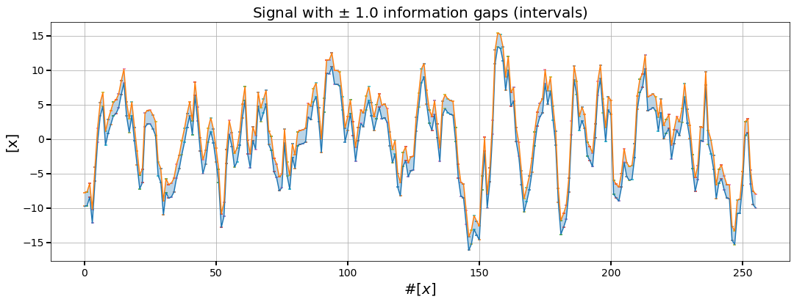
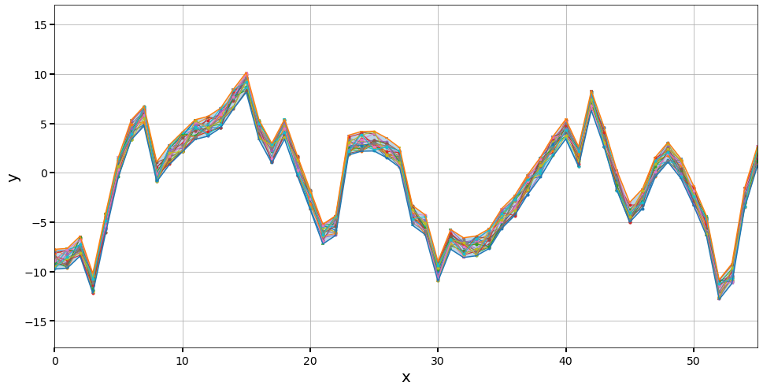
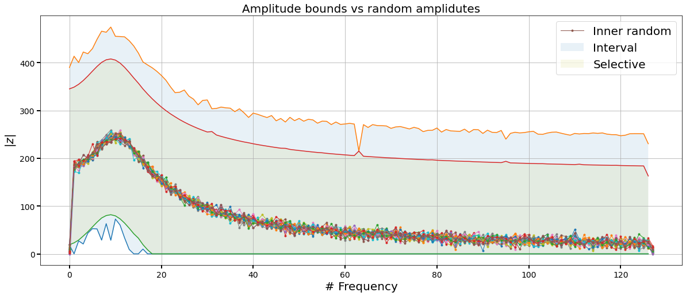
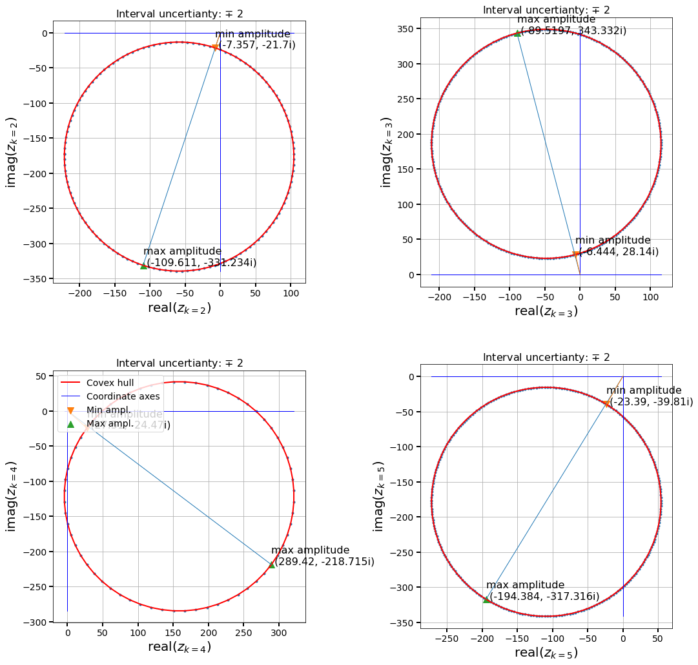

# Fourier-transform
Fourier transform code for gappy (intervalized) signals.

This code implements the idea developed in the paper:

*Forward interval propagation through the Fourier discrete transform*. 
M De Angelis, M Behrendt, L Comerford, Y Zhang, M Beer; 
arXiv preprint [arXiv:2012.09778].

[https://arxiv.org/abs/2012.09778]: arXiv:2012.09778

```latex
@misc{deangelis2020forward,
      title={Forward interval propagation through the Fourier discrete transform}, 
      author={Marco De Angelis and Marco Behrendt and Liam Comerford and Yuanjin Zhang and Michael Beer},
      year={2020},
      eprint={2012.09778},
      archivePrefix={arXiv},
      primaryClass={eess.SP}
}
```

# How to use the code library

### Import the *gappy Fourier transform* package


```python
from lib.fourier import transform as gappyFT
```

### Generate a signal from a stationary power spectrum

This generates a *precise* signal.


```python
signal,n = gappyFT.generate_signal(N=8) # Shinozuka
# NN = 2**N #=64
```


```python
gappyFT.plot_signal(signal,lw=1,title='Signal from stationary power spectrum',color='rebeccapurple')
```


## Intervalize the signal
Let us add $\pm$1 interval uncertainty to the time signal. 


```python
intervalsignal = gappyFT.intervalize(signal, plusminus=1.0) # outputs an interval vector
```


```python
print(intervalsignal)
```

    【-2.36916, -0.36916】
    【1.20444, 3.20444】
    【6.66901, 8.66901】
    【3.45785, 5.45785】
    【3.17543, 5.17543】
    ...
    【3.23294, 5.23294】
    【-1.76045, 0.239546】
    【-5.23176, -3.23176】
    【-6.72218, -4.72218】


Interval vectors have support for plotting as shown in the next cell.


```python
intervalsignal.plot\
(xlabel=r'#$[x]$',ylabel=r'[x]',title=r'Signal with $\pm$ 1.0 information gaps (intervals)')
```





## Pick out a signal within the bounds

Any signal within the interval bounds is allowed. So let's generate a few signals using the `IntervalSignal` API.


```python
RAND_SIGNALS = intervalsignal.rand(N=4) # this picks out N (inner) random signals within the bounds
```

### Let's plot the `N` randomly generated signals withint the bounds over the interval signal


```python
fig,ax = gappyFT.subplots(figsize=(16,8))
for rs in RAND_SIGNALS:
    gappyFT.plot_signal(rs,ax=ax)
intervalsignal.plot(ax=ax)
ax.grid()
ax.set_xlim(0,55)
```




## We are now ready to compute the amplitude of the *gappy* signal

We can do so using the polymorphic `Fourier_amplitude` function, which accepts both a precise and interval signal. 

However the bounds that we obtain, as shown in the following figure, are quite puffy.


```python
FA = gappyFT.Fourier_amplitude(signal)
IFA= gappyFT.Fourier_amplitude(intervalsignal)
```

Let's plot the obtained bounds against some inner generated signals


```python
FA_rand1 = gappyFT.Fourier_amplitude(intervalsignal.rand())
FA_rand2 = gappyFT.Fourier_amplitude(intervalsignal.rand())
FA_rand3 = gappyFT.Fourier_amplitude(intervalsignal.rand())
```


```python
fig,ax = gappyFT.subplots(figsize=(16,8))
gappyFT.IntervalVector(IFA).plot(ax=ax,alpha=0.1)
gappyFT.plot_signal(FA,ax=ax,lw=3)
gappyFT.plot_signal(FA_rand1,ax=ax)
gappyFT.plot_signal(FA_rand2,ax=ax)
gappyFT.plot_signal(FA_rand3,ax=ax)
ax.grid()
ax.set_xlim(0,65)
```


We can even plot more inner signals using the `IntervalSignal` API and a loop


```python
RAND_SIGNALS = intervalsignal.rand(N=20) 
```


```python
fig,ax = gappyFT.subplots(figsize=(16,8))
gappyFT.IntervalVector(IFA).plot(ax=ax,alpha=0.1)
gappyFT.plot_y(FA,ax=ax,lw=3)
for rs in RAND_SIGNALS:
    FA_r = gappyFT.Fourier_amplitude(rs) # computes amplitude for each generated signal
    gappyFT.plot_y(FA_r,ax=ax) # plots amplitude of randomly generated signal
ax.grid()
ax.set_xlim(0,65)
```


## Compute both the interval bounds (BI) and the selective bounds (BS).

The single function `compute_amplitude_bounds` will compute and output both bounds.


```python
BI,BS = gappyFT.compute_amplitude_bounds(intervalsignal) # this can take a bit
```

Let's plot the results


```python
fig,ax = gappyFT.subplots(figsize=(20,8))
# gappyFT.IntervalVector(IFA).plot(ax=ax,alpha=0.1)
gappyFT.IntervalVector(BI).plot(ax=ax,alpha=0.1,marker='',label='Interval')
gappyFT.IntervalVector(BS).plot(ax=ax,alpha=0.1,marker='',label='Selective')
gappyFT.plot_y(FA,ax=ax,lw=3)
for rs in RAND_SIGNALS:
    FA_r = gappyFT.Fourier_amplitude(rs) # computes amplitude for each generated signal
    gappyFT.plot_y(FA_r,ax=ax) # plots amplitude of randomly generated signal
gappyFT.plot_y(FA_r,ax=ax,label = 'Inner random') # this line is only for legend purposes
ax.set_title('Amplitude bounds vs random amplidutes',fontsize=20)
ax.set_xlabel('# Frequency')
ax.set_ylabel(r'$|z|$')
ax.legend(fontsize=20)
ax.grid()
```





## Verification of results

The library enables also the verification of results for given frequencies.

An visual inspection can be used to verify the rigour of the bounds for each frequency.


```python

```


```python

```


```python

```


```python

```


```python

```


```python

```


```python

```


```python

```


```python

```


```python
impdft.plot_spectrum_bounds_2x2(AA,signal,u)
```


```python
impdft.plot_ch_2x2(intervalsignal_arr,freq=[2,3,4,5],figsize=(15,15),aspect='equal')
```





```python

```


```python

```
